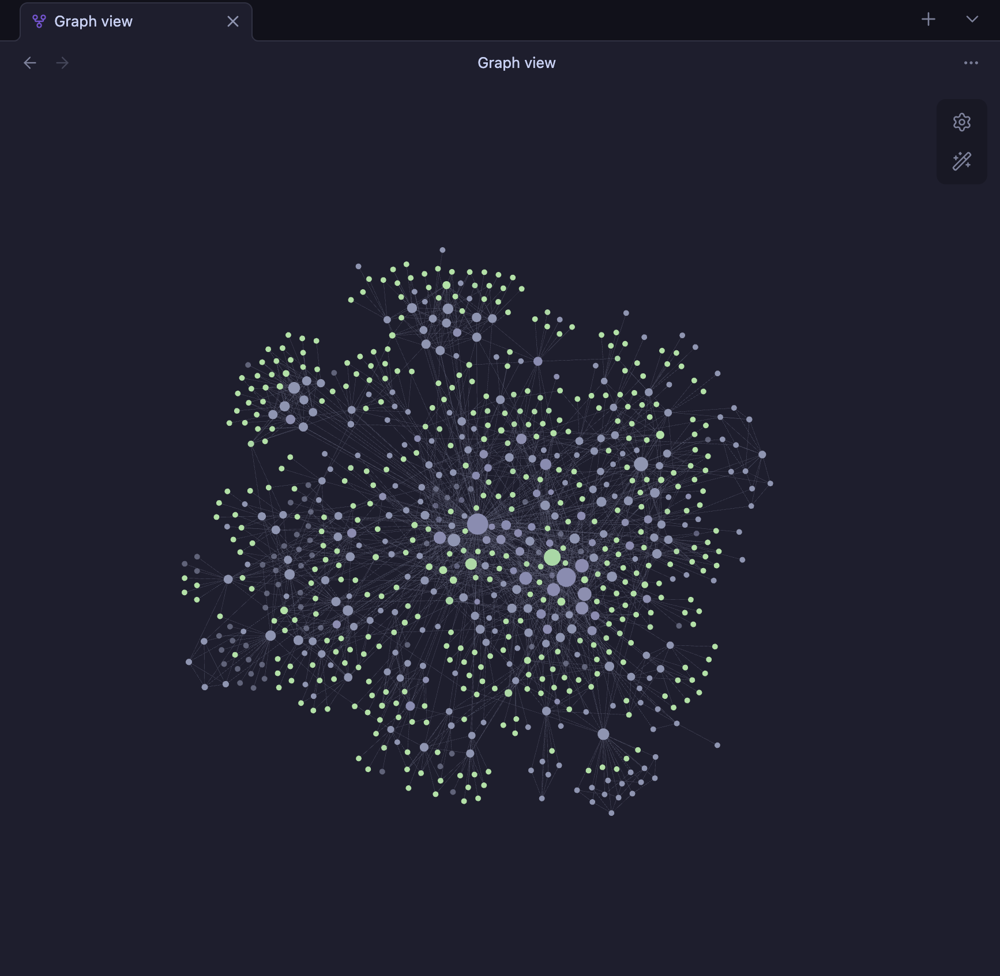

# LLM Wiki

A personal knowledge base maintained by Claude Code — following the **LLM Wiki pattern**.

The LLM writes and maintains the wiki. You source, explore, and ask questions.



---

## What is this?

Instead of RAG (re-deriving knowledge from scratch on every query), this system builds a **persistent, compounding wiki** between you and your raw sources.

- Add a source → Claude reads it, summarizes it, updates all related concept pages, cross-references everything
- Ask a question → Claude searches the wiki, synthesizes an answer from what's already been compiled
- Every ingest makes future queries better — knowledge accumulates, never starts from zero

**Three layers:**

```
raw/          ← your curated sources (immutable — never modified)
wiki/         ← LLM-generated pages (summaries, concepts, analyses)
CLAUDE.md     ← schema that tells the LLM how to maintain the wiki
```

---

## Quick Start

### 1. Open Claude Code in this vault

```bash
cd path/to/your-vault
claude
```

### 2. Check current state

```
/status
```

### 3. Clip or drop a source and ingest it

**From a URL** (recommended):

```
/clip https://example.com/article
```

**From a local file** (dropped into raw/ manually):

```
/ingest raw/clips/article.md
/ingest raw/notes/topic-folder/
```

### 4. Ask questions

```
/query what is context propagation in distributed systems
/query compare LangChain vs LlamaIndex
```

---

## Directory Structure

```
vault/
├── CLAUDE.md          ← master schema + operating instructions (LLM reads this)
├── README.md          ← this file
├── index.md           ← content catalog (LLM updates on every ingest)
├── log.md             ← append-only operation log
│
├── raw/               ← SOURCE OF TRUTH — never modified by LLM
│   ├── clips/         ← web articles (Obsidian Web Clipper or /clip)
│   ├── books/         ← book files, PDFs, chapter notes
│   ├── notes/         ← manual notes organized by topic folder
│   └── assets/        ← locally downloaded images
│
├── wiki/              ← LLM-generated wiki (you read; LLM writes)
│   ├── concepts/      ← concept/principle pages
│   ├── books/         ← book summary pages
│   ├── sources/       ← per-source summary pages
│   ├── synthesis/     ← analyses, comparisons, big-picture essays
│   ├── canvas/        ← visual knowledge maps (.canvas)
│   └── bases/         ← Obsidian Bases database views (.base)
│
└── .claude/           ← Claude Code configuration
    ├── commands/      ← slash commands
    └── skills/        ← automatic skill behaviors
```

---

## All Commands

| Command                 | What it does                                               |
| ----------------------- | ---------------------------------------------------------- |
| `/status`               | Dashboard: page counts, pending raw files, recent activity |
| `/ingest [path]`        | Add a source — creates wiki pages, updates index + log     |
| `/clip [url]`           | Clip a URL to raw/clips/ via defuddle, then offer ingest   |
| `/query [question]`     | Answer a question from the wiki                            |
| `/research [topic]`     | Web search to fill wiki gaps (uses defuddle for URLs)      |
| `/lint`                 | Health check: orphans, contradictions, missing concepts    |
| `/synthesis [topic]`    | Deep analysis → permanent synthesis page                   |
| `/canvas [topic]`       | Create a visual knowledge map (.canvas) for a topic        |
| `/base [name]`          | Create an Obsidian Bases database view (.base)             |
| `/new-concept [name]`   | Create a concept page without a source                     |
| `/new-book [title]`     | Create a book summary page                                 |
| `/update [page] [what]` | Update an existing wiki page                               |
| `/note [text]`          | Save a quick note to raw/notes/                            |
| `/init [name]`          | Initialize a new wiki vault from scratch                   |

---

## Recommended Workflows

### Every new session

```
/status
```

### Clipping an article

**Direct from URL (recommended):**

```
/clip https://example.com/article
```

**Via Obsidian Web Clipper:**

```
1. Use Obsidian Web Clipper → saves to raw/clips/
2. /ingest raw/clips/article.md
```

### Research deep-dive (new topic folder)

```
1. Drop notes into raw/notes/topic-name/
2. /ingest raw/notes/topic-name/
3. /query [question about the topic]
```

### Fill knowledge gaps

```
/research [topic]
```

### Weekly maintenance

```
/lint
```

### Big question across multiple topics

```
/synthesis [question]
```

### Visualize a knowledge area

```
/canvas [topic]
```

### Browse wiki as a database

```
/base sources     ← table of all sources
/base concepts    ← card gallery of all concepts
/base all         ← full wiki dashboard
```

---

## Link Navigation

Every wiki page follows a strict 3-layer hierarchy:

```
index.md
    ↓
wiki/sources/  wiki/concepts/  wiki/books/  wiki/synthesis/
    ↓ (sources only)
raw/clips/  raw/notes/  raw/books/
```

- `index.md` never links to `raw/` directly
- Only `wiki/sources/` pages contain the "Full source" link to raw files
- All inter-wiki links use Obsidian `[[...]]` syntax

---

## Setting Up Obsidian

This vault works best with **Obsidian** as your reader:

1. Open Obsidian → Add vault → select this folder
2. Enable **Dataview** plugin (for frontmatter queries)
3. Enable **Marp** plugin (optional — for slide exports)
4. Install **Obsidian Web Clipper** browser extension for clipping articles
5. In Settings → Files and links → set attachment folder to `raw/assets/`

Use **Graph View** to see which concepts are connected, which pages are hubs, and which are orphans.

**New capabilities with installed skills:**

| Feature     | How to use                                                                       |
| ----------- | -------------------------------------------------------------------------------- |
| Canvas      | `/canvas [topic]` → opens as visual map in Obsidian Canvas view                  |
| Bases       | `/base [name]` → opens as table/card view in Obsidian Bases                      |
| Web clip    | `/clip [url]` → uses `defuddle` CLI (install: `npm install -g defuddle`)         |
| CLI control | `obsidian-cli` — requires Obsidian open; install via `brew install obsidian-cli` |

---

## Starting a New Vault

To create a new wiki vault from scratch:

```bash
mkdir my-wiki && cd my-wiki
claude
/init My Research Wiki
```

Or copy the `.claude/` folder from this vault into your new directory, then run `/init`.

---

## Technical Notes

- The wiki is a plain git repo — `git log`, branches, and diffs work normally
- Edit any `.claude/commands/*.md` file to customize how Claude behaves
- The schema lives in `CLAUDE.md` — edit it to change page formats, workflows, or conventions
- Primary language: Thai for wiki content, English for config and code
- See `.claude/README.md` for full command and skill documentation

Ref : https://gist.github.com/karpathy/442a6bf555914893e9891c11519de94f#file-llm-wiki-md
